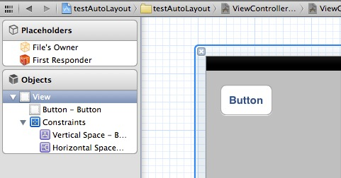
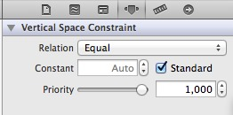
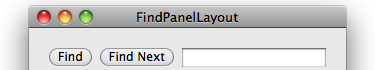

### Overview

其实作为 iOS 开发者，拿到了 iPhone 6 plus 测试机之后还是蛮兴奋的，屏幕很大、速度飞快、天天酷跑也diao得飞起。但随之而来的很严峻的问题也摆在了眼前——分辨率不一样了！[^1]对，再也不是 5s 之前的 320px 了！ iPhone 6 现在是 375px，而 6 plus 是 414px。[^2] 之前我们还可以用屏幕宽高来分别计算一下位置，现在要做4、5、6、plus一共4种判断？那一定是疯了吧！所以使用 Autolayout 迫在眉睫！那我就趁着立冬，边吃饺子边讲解一些有关 iOS 屏幕适配的事情吧。（吸溜～

### Introduce

**Apple的官方定义:**

> Auto Layout Is a Constraint-Based, Descriptive Layout System.<br />
> AutoLayout 是一种基于约束的，描述性的布局系统。 

- 基于约束: 和以往定义 frame 的位置和尺寸不同，AutoLayout 的位置确定是以所谓相对位置的约束来定义的。
- 描述性: 约束的定义和各个view的关系使用接近自然语言或者可视化语言的方法来进行描述。
- 布局系统: 即字面意思，用来负责界面的各个元素的位置。

> Describe the layout with constraints, and frames are calculated automatically.<br />
> 使用约束条件来描述布局，view 的 frame 会依据这些约束来进行计算。

### Interface Builder

最简单的 Autolayout 使用方法是在 IB 中直接拖。在 IB 中任意一个 view 的 File inspector 下面，都有 Use Autolayout 的选择框，然后按照平常那样拖控件就可以了。拖动控件后在左边的 view hierarchy 栏中会出现 Constraints 一项，其中就是所有的约束条件：



选中某个约束条件后，在右边的Attributes inspector中可以更改约束的条件，距离值和优先度等:



对于没有自动添加的约束，可以在 IB 中手动添加。选择需要添加约束的 view，点击菜单的 `Edit->Pin` 里的需要的选项，或者是点击 IB 主视图右下角的   按钮，即可添加额外的约束条件。

很直观的可以看到，我们现在不是定位控件的坐标，而是约束其相对于其他控件（包括其 superview）的<span style="color:#ff0000;">相对位置</span>（类似于 CSS 中的 `margin`）。例如：`button` 距离 `self.view` 左边界和上边界都是 20px，或者对 `self.view` 水平垂直居中，或者等于屏幕 1/3 宽……如果只限制了上、左边界，那这个 `button` 的宽高会根据 `title.label` 上文字的大小自动布局。

### Constraints using code

纯代码构建一个约束有两种模式：*参数模式*和*可视化语言模式*。

iOS 6中新增加了一个类： `NSLayoutConstraint`。（绝大部分的项目都慢慢不再支持 iOS 5了，小伙伴们可以尽量尝试使用最新的方式吧。

- 参数模式：
    
```objc
    [NSLayoutConstraint constraintWithItem:button               // 约束对象为 button
                             attribute:NSLayoutAttributeBottom  // 约束 button 的 bottom 属性
                             relatedBy:NSLayoutRelationEqual    // 约束条件是“等于”
                                toItem:superview                // 约束对象是 superview
                             attribute:NSLayoutAttributeBottom  // 约束对象的 bottom 属性。
                            multiplier:1.0                      // 约束的倍数，跟下面的参数是乘积关系
                              constant:0.0f]                    // 两个对象的约束属性“等于”多少
```
    
- VFL模式：(Visual Format Language)

可能 Apple 开发人员觉得那种“自然语言”写着太难了？于是就发明了另一种“可视化格式”的语言来增加其难度。[^3]

这种可视化模式可以实现一些简单的约束，比如：宽度、水平间距、垂直间距、优先级或者让两个对象垂直布局等……

```objc
/**
 水平布局
 find 到 superview 左边界间距 20
 find 和 findNext 间距 10
 findNext 到 findField 间距 10
 findField 宽度不小于 30
 findField 到 superview 右边界间距 20。
*/
NSString *constraintString = @"H:|-20-[find]-10-[findNext]-10-[findField(>=30)]-20-|";
[NSLayoutConstraint constraintsWithVisualFormat:constraintString
                                        options:0 
                                        metrics:nil 
                                          views:viewsDictionary];
```

例如上面的代码最终显示为这样：




需要注意的几点：

1. 设置约束之前，一定要让该对象被 `addSubview` 过。
2. UIScorllView 的 IB 约束会出现 `Ambiguous Layout` 警告！尝试了一种很 low 的解决方案，但是我觉得其成本不如用代码来实现划算。
3. 对于有些因为 UI 的不确定性导致的约束冲突，可以降低发生冲突的对象的某个约束的优先级。
4. 如果要使用约束来进行布局，一定要设置 `view.translatesAutoresizingMaskIntoConstraints = NO;`，禁止 `AutoresizingMask` 自动转化。
5. iOS 8 以后的激活约束的方式变成了 `[NSLayoutConstraints activateConstraints:]` 。之前的写法 `[view addConstraints:]` 已经不建议使用了，不过为了兼容 iOS 6 和 7 ，最好写一个编译时宏来判断一下。

### Masonry

我相信耐着性子看完上面的原生约束的同学现在已经准备放弃使用 Autolayout 来布局了：“我写判断给每个控件用 frame 布局都没这么麻烦！”

好的，这位同学请你坐下，显然这种东西我们了解一下就行了，毕竟 SnapKit 已经给我们提供了一个写法简洁优雅的开源工具：[Masonry](https://github.com/SnapKit/Masonry)

这位同学不要着急，把手放下。我知道你们可能不相信，Linus Torvalds 曾经说过：`Talk is cheap, show me the code.` 那我们先来看看代码：

```objc
UIEdgeInsets padding = UIEdgeInsetsMake(10, 10, 10, 10);
[view1 mas_makeConstraints:^(MASConstraintMaker *make) {
    make.edges.equalTo(superview).with.insets(padding);
}];
```

好，下课 …… 有话好好说不要动手！大家看到了，用 block 形式对 view1 进行了约束。所有的约束条件通过参数 `make` 在 block 中通过链式编程实现了简洁易读。其实这种链式调用在 jQuery[^4] 中很早就出现了，Masonry 这个举措应该是让许多 OC 开发者发现了更广阔的知识领域。

Masonry 中链式调用实际上就是在每一步操作的方法中返回一个当前类的对象。其返回类型分为两种：

1. 关联类： 例如 `offset()` 或者 `equalTo()`
首先最外层它会返回一个 `MASConstraint * (^)(CGFloat)` 闭包函数。而这个闭包函数的返回值是一个匿名闭包函数 `^id(CGFloat offset)` 其返回对象是 `self`，其代表的即是 `offset(12)` 括号中的数字。
2. 属性类： 例如 `top`
所有 `top` `trailing` 等等这些属性都会调用 `-addConstraintWithLayoutAttribute:` 这个方法：

```objc
- (MASConstraint *)addConstraintWithLayoutAttribute:(NSLayoutAttribute)layoutAttribute {
    return [self constraint:nil addConstraintWithLayoutAttribute:layoutAttribute];
}
```

这个方法最终会调用 `-constraint:addConstraintWithLayoutAttribute:` 这个方法，最终返回值就是类本身 `MASConstraint *` 这样就可以实现无限的链式调用了。

Masonry 是对原生 Constraints 的封装，所以原生有的功能它都能实现。也不用设置禁止 `AutoresizingMask` 的自动转换，也不用考虑激活约束的方式。只需要添加到 superview 上，直接使用！墙裂推荐同学们都是用这个开源库，并且建议同学们仔细阅读文档，同时阅读源码加深记忆。

好啦，这次真的下课了！起立！

### References

[^1]: [Screen Sizes](http://screensiz.es/phone)  
[^2]: [iPhone Resolution](http://iosres.com)  
[^3]: [Apple Developer: Visual Format Syntax](https://developer.apple.com/library/content/documentation/UserExperience/Conceptual/AutolayoutPG/VisualFormatLanguage.html)  
[^4]: [JS的链式调用](http://www.cnblogs.com/xesam/articles/2259485.html)

