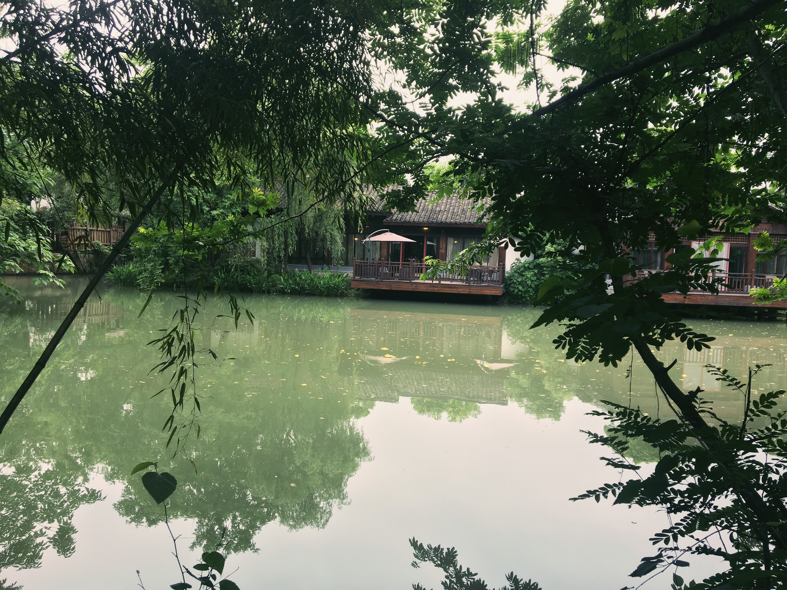
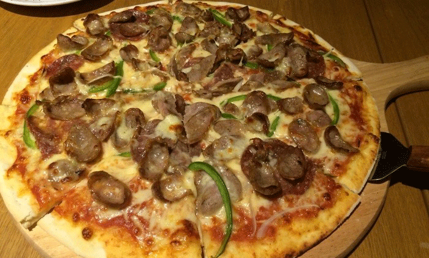
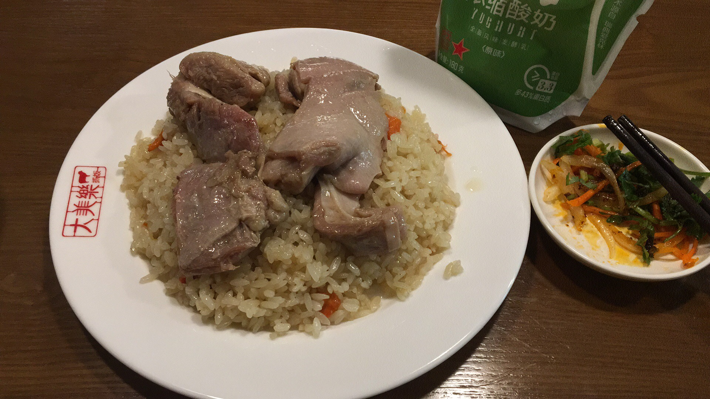

<style type="text/css">
    .gallery {
        margin: 0 auto;
        max-width: 60rem;
    }
    .left {
        max-width: 50%;
        margin-left: 0;
        margin-top: 0;
    }
    .right {
        max-width: 50%;
        margin-right: 0;
        margin-top: 0;
    }
</style>

# 缘起

学习 Linux 半年多了，也没怎么好好休息过。借着好友 WinHand 的邀请，将简历投到杭州，顺便过来玩几日。前些日子来过一次，对杭州的印象非常不错，此次再来不能像上次一样匆忙了。（其实也是很匆忙的）

# 西溪湿地公园

下午到的杭州，紧接着就去公司面试，之后就去朋友单位等他下班。公交车上拖动着地图，看到一个敲～大的绿色区域 —— 西溪湿地公园。既然离他下班还有2小时，不如先去转转！

- 不得不说共享单车真是一个好东西，现在5、6 km 的路途我都已经习惯了骑行方式。（公交车等候时间太久了，加上长三角地区路面多平坦，骑行时分的惬意。）
- 杭州的机动车在人行道上礼让行人的行为据说已经持续 10 多年了。就算是行人闯了红灯，也会发现公交车在远远的地方就开始减速，司机师傅也会向你摆手让你快速通过。（不，并不会礼让非机动车的！）
- 杭州的绿化程度相当出色，和其他城市的绿化带相比，这边简直就是绿化堡垒。根据植被的高矮和特征会有好几层绿化带。（是的，是 G20 带来的成果，也有之前城市规划的功劳。）


作为一名合格的`膜法师`怎么能不对长者表示尊敬呢？🙃

不过很不幸今天不能骑车进行游玩了（估计走不了多远就要回返了）


精挑细选了几张，感觉还不错！

<div class="gallery">




</div>

-----------

就在我发了朋友圈炫耀了一下之后，来自澳洲的鄙视就出现了：

<figure>

<figcaption><a href="../images/jounery-hangzhou/IMG_4408.JPG">澳洲国家湿地公园</a></figcaption>
</figure>

看完朋友发过来的图，再对比一下脏兮兮的湿地，顿时失去了兴趣。（并不，只是朋友喊我去吃饭了。）

> 原图 11M，压缩完之后也有 8M，给个链接，想看的自己点链接吧！

# 西湖白堤断桥

完全不熟悉杭州的交通情况，导致上午的面试迟到了1分钟！（通常我都是提前半小时到，熟悉一下环境，并给出足够的缓冲时间的。）中午之后就没什么事情了，就决定去上次没走完的西湖！下了地铁，扫了辆共享单车，按照地图上指的方向，一路奔向了星巴克西湖天地店（捂脸）。

对面就是白堤，点了杯饮料之后就去湖边坐着、看着、想着，似乎平日里的烦闷也被湖水清洗干净了。

```
山色如娥，花光如颊，温风如酒，波纹如绫，才一举头，已不觉目酣神醉。
西湖最盛，为春为月。一日之盛，为朝烟，为夕岚。
其实湖光染翠之工，山岚设色之妙，皆在朝日始出， 夕舂未下，始极其浓媚。
                            ----(明)袁宏道《西湖游记》节选
```

<div class="gallery">


</div>

<figure>

<figcaption><a href="../images/jounery-hangzhou/IMG_4421.JPG">接天莲叶无穷碧，映日荷花别样红。</a></figcaption>
</figure>


# 披萨手抓饭杭帮菜

<span style="font-size:2rem;">第一天</span>我们几个去吃的是黄龙万科中心楼下的 <span style="font-size:1.5rem;color:red;">味德西餐酒吧</span> (WADE's Bar & Grill)。

港真这边周末过来吃的话全场打 8 折，价格就相当实惠了！披萨做得贼好，面饼很薄，芝士超足量！



店员大部分都是黑人小哥哥小姐姐，有几个小哥汉语说得贼6，还前凸后翘的十分 hot 。


----------

<span style="font-size:2rem;">第二天</span>吃的朋友推荐的新疆手抓饭(پولۇ)，味道没得说的：充分浸泡过的米饭上盖了两大片羊排肉，羊肉味十足而且一点都不膻。在经过几道<span style="border-bottom:1px dotted #3333ee;" title="形容词而已，我并不知道他家的工序。">复杂的工序</span>之后，做出来的羊肉肥而不腻，入口即化。



店名叫 <span style="font-size:1.5rem;color:red;">大美乐抓饭</span>，大众点评分数极高！


----------

# 补图


